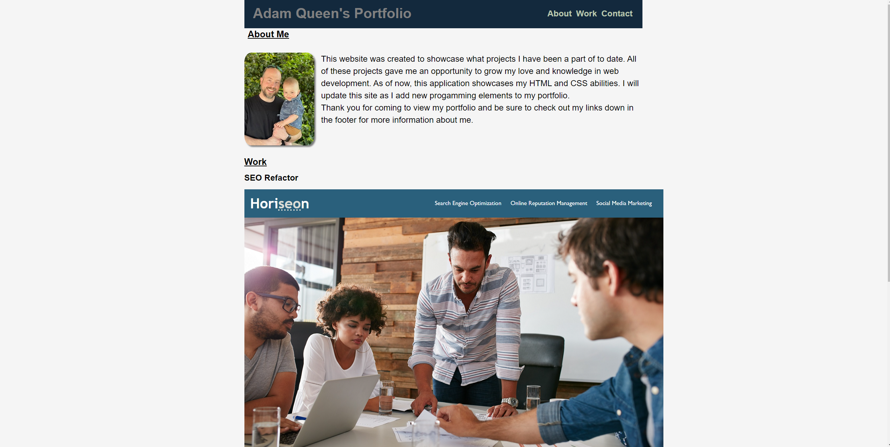

# Adam Queen's Portfolio

[Link to my project](https://smoke5643.github.io/adam-queen-portfolio/)

## Table of Contents
- [Description](#description-of-project)
- [Visuals](#visuals)

## Description of project

Through the techniques we have been taught in our bootcamp thus far, I have created a portfolio for myself showcasing my achievements. I believe my coding and troubleshooting skills have greatly improved by completing these showcased applications, as well as, this portfolio.

## Visuals

Preview of my portfolio

